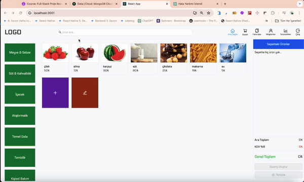

<h1> Fullstack_POSApp </h1

##
<ul>

  Technologies:
  <li>React (Single Page Application)</li>
  <li>React-Router-Dom</li>
  <li>Ant Design and Tailwind CSS</li>
  <li>Express.js</li>
  <li>MongoDB <li>
</ul>

<ul>
## Project Development Topics:
 <li>Freelance Project Development Logic <li>
 <li>Using React-Router-Dom <li>
 <li>Building Projects with Ant Design and Tailwind CSS in React <li>
 <li>Full-Stack Project Development with MERN (MongoDB, Express.js, React, Node.js) Stack <li>
 <li>Using Tailwind CSS for Responsive Design <li>
 <li>Authentication Processes with MongoDB <li>
 <li>State Management with Redux-Toolkit <li>
 <li>Invoicing Products in a Real-Life Project <li>
 <li>Database Operations with MongoDB <li>
 <li>Creating an API from Scratch <li>
 <li>Password Hashing <li>
 </ul>

<h2> Screenshot </h2>

